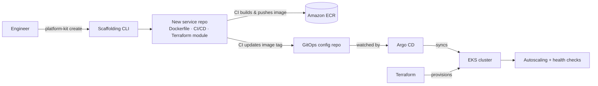

# platform-kit

A small internal developer platform on AWS: the infrastructure and tooling that other engineers would use to ship services, rather than a product for end users.

It covers the whole path from "I need a new service" to "it's running in production, scaling and recoverable":

- **Infrastructure as code.** An EKS cluster and its networking, defined in Terraform.
- **GitOps delivery.** Argo CD watches a config repo. Merging a change rolls it out to the cluster, and reverting the commit rolls it back.
- **Production behaviour.** Health checks and autoscaling, demonstrated by load-testing with k6 and by killing pods to show recovery.
- **A scaffolding CLI.** One command generates a new service with its Dockerfile, Terraform module, CI/CD pipeline and monitoring already wired up. This treats the platform as something other engineers consume.

**Scope.** The first version targets AWS (EKS) with Node.js services. Python service templates and other cloud providers (GCP, Azure) come next. The design keeps those additions to new templates and a new Terraform cloud layer, not a rewrite.

> **Status: in progress.** The repo is at an early stage. The sections below describe the target design. Commands marked *(planned)* don't exist yet. See [Roadmap](#roadmap) for what's done.

## How it fits together



1. An engineer runs the CLI to create a service.
2. The service's CI pipeline builds a container image and pushes it to ECR.
3. CI then commits the new image tag to the GitOps config repo.
4. Argo CD notices the change and syncs the cluster to match Git.
5. Kubernetes keeps the service healthy (probes, restarts) and scales it with load.

## Repository layout *(planned)*

```
platform-kit/
├── cli/            # Scaffolding CLI (Node.js)
├── templates/      # Service templates the CLI generates from
├── infra/          # Terraform: VPC, EKS, IAM, ECR
├── gitops/         # Argo CD applications and Kubernetes manifests
├── services/       # Example Node.js service
├── load-tests/     # k6 scripts
└── docs/           # Decision log, write-up, demo
```

## Prerequisites

- An AWS account and credentials configured for the AWS CLI
- [Terraform](https://developer.hashicorp.com/terraform/install) >= 1.5
- [kubectl](https://kubernetes.io/docs/tasks/tools/)
- [Node.js](https://nodejs.org/) >= 20
- [Docker](https://docs.docker.com/get-docker/)
- [k6](https://grafana.com/docs/k6/latest/set-up/install-k6/) (for load tests)

> **Cost warning:** EKS, NAT gateways and load balancers are billed by the hour. Tear everything down when you finish (see step 6).

## Running it *(planned)*

### 1. Provision the infrastructure

```bash
cd infra
terraform init
terraform apply
aws eks update-kubeconfig --name platform-kit --region <region>
```

### 2. Install Argo CD and register the apps

```bash
kubectl apply -k gitops/bootstrap
```

From this point on, the cluster follows the GitOps config. Deployments happen by committing to Git, not by running `kubectl apply`.

### 3. Scaffold a new service

```bash
npx platform-kit create my-service
```

This generates a ready-to-deploy service:

- a Node.js app with health endpoints
- a Dockerfile
- a CI/CD pipeline that builds, pushes and updates the GitOps config
- a Terraform module for the service's AWS resources
- Kubernetes manifests with probes, resource limits and autoscaling
- monitoring config

### 4. Deploy and roll back

- **Deploy:** push to the service repo. CI updates the image tag in the config repo, and Argo CD rolls it out.
- **Roll back:** `git revert` the config commit. Argo CD rolls the cluster back to the previous version.

### 5. Show it scaling and recovering

```bash
k6 run load-tests/basic.js              # watch: kubectl get hpa -w
kubectl delete pod -l app=my-service    # watch the replacement come up
```

### 6. Tear down

```bash
cd infra && terraform destroy
```

## Design decisions

The trade-offs matter more than the code here. Each significant choice, such as Argo CD vs Flux or how secrets are handled, is recorded with its reasoning and the alternatives rejected in **[docs/decision-log.md](docs/decision-log.md)**.

## Roadmap

- [ ] Terraform: VPC, EKS cluster, ECR
- [ ] Example Node.js service with health endpoints
- [ ] Argo CD bootstrap and GitOps config
- [ ] Health checks and autoscaling (HPA)
- [ ] k6 load test and pod-failure demo
- [ ] Scaffolding CLI with service template
- [ ] CI/CD pipeline in the template
- [ ] Monitoring wired into the template
- [ ] Write-up and recorded demo of the CLI
- [ ] Python service template
- [ ] Second cloud provider (GCP or Azure)

## Demo

*Coming soon:* a short recording of the CLI creating a service from scratch and Argo CD deploying it.

## License

[MIT](LICENSE)
